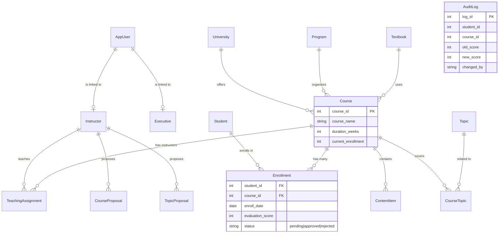

# Course Management System — Project Report

**Team Name:** Index Corruption  
**Date:** 2026-02-10

## Team Members
- **Ashutosh Sharma** (23CS10005)
- **Sujal Anil Kaware** (23CS30056)
- **Parag Mahadeo Chimankar** (23CS10049)
- **Kshetrimayum Abo** (23CS30029)
- **Kartik Pandey** (23CS30026)

---

## 1. Project Architecture

The system follows a modern **Client-Server Architecture** with strict separation of concerns, ensuring scalability and maintainability.

### **Frontend (Client)**
- **Framework:** [Next.js 15](https://nextjs.org/) (React Framework)
- **Language:** TypeScript
- **Styling:** [Tailwind CSS v4](https://tailwindcss.com/)
- **UI Library:** [Shadcn/UI](https://ui.shadcn.com/) (Radix Primitives)
- **Features:** Client-side routing, Responsive Design, Dark Mode support, Interactive Dashboards.

### **Backend (Server)**
- **Framework:** [FastAPI](https://fastapi.tiangolo.com/) (Python)
- **Language:** Python 3.11+ (Async/Await)
- **Database Driver:** `asyncpg` (Asynchronous PostgreSQL driver)
- **ORM:** [SQLAlchemy 2.0](https://www.sqlalchemy.org/) (Async Mode)
- **Validation:** Pydantic Models for request/response bodies.

### **Database**
- **System:** PostgreSQL
- **Pattern:** Relational Database with normalized schema (3NF).
- **Advanced Features:** Triggers, Stored Procedures (implied), Window Functions, Transaction Isolation (Pessimistic Locking).

---

## 2. Database Schema & ER Diagram

The database is designed to handle users, academic entities, and their complex relationships. Below is the Entity-Relationship Diagram (ERD).

### Key Tables
1.  **Core Entities:** `Student`, `Instructor`, `Course`, `University`.
2.  **Junction Tables:** `Enrollment` (Student ↔ Course), `TeachingAssignment` (Instructor ↔ Course), `CourseTopic`.
3.  **Proposals:** `CourseProposal`, `TopicProposal` (for workflow approval).
4.  **Audit:** `AuditLog` (Captures grade changes via Database Triggers).

---

## 3. Functionalities & Features

### **Role-Based Access Control (RBAC)**
The system supports multiple distinct roles with specific permissions:
- **Student:** View courses, apply for enrollment, view grades.
- **Instructor:** Manage assigned courses, add content, grade students, view analytics.
- **Admin:** Approve instructors/courses, manage system-wide data.
- **Analyst:** View system reports and aggregated statistics.

### **Key Workflows**
1.  **Course Enrollment:**
    - Students browse catalog → Apply (Status: `pending`).
    - Instructor views applications → Approves/Rejects.
    - Enrollment count updates automatically.
2.  **Course Management:**
    - Instructors upload Content Items (Videos, Books, Notes).
    - Instructors assign grades to approved students.
3.  **Advanced Analytics:**
    - **Score Distribution:** Histograms of class performance.
    - **Pass/Fail Rates:** Visual breakdown of student success.
    - **Rankings:** Class rank calculation using Window Functions (`RANK`, `DENSE_RANK`).

### **Advanced DBMS Implementations**
1.  **Window Functions:** Used in `/instructor/courses/{id}/rankings` to calculate `RANK()`, `DENSE_RANK()`, `PERCENT_RANK()` for student scores dynamically.
2.  **Database Triggers:** Used to populate the `audit_log` table whenever a student's grade is changed.
3.  **Concurrency Control:** Implemented **Pessimistic Locking** (`SELECT ... FOR UPDATE`) in the `/safe-enroll` endpoint to prevent race conditions when multiple students try to grab the last seat.
4.  **Transaction Management:** `COMMIT` and `ROLLBACK` ensure data integrity during multi-step operations (e.g., proposals, enrollments).

---

## 4. API Specification (Summary)

### **Authentication**
- `POST /auth/token` — Login (OAuth2 Password Flow).
- `POST /auth/register` — Register new user.

### **Student APIs**
- `GET /student/courses` — List all available courses with filters.
- `GET /student/courses/{id}` — Detailed view (includes live enrollment count).
- `GET /student/enrollments/me` — View my approved enrollments.
- `POST /student/enrollments` — Apply for a course.

### **Instructor APIs**
- `GET /instructor/courses` — List assigned courses.
- `GET /instructor/courses/{id}/students` — List approved students.
- `POST /instructor/courses/{id}/applications/approve` — Approve student application.
- `GET /instructor/courses/{id}/analytics` — Get score distribution and pass rates.
- `GET /instructor/courses/{id}/rankings` — **(Advanced)** Get student rankings via Window Functions.
- `POST /instructor/courses/{id}/safe-enroll` — **(Advanced)** Enroll with Pessimistic Lock.
- `GET /instructor/courses/{id}/audit-log` — **(Advanced)** View trigger-generated audit logs.

---

## 5. Presentation Outline (5 Slides)

### **Slide 1: Title Slide**
- **Project Name:** Course Management system
- **Team Name:** Index Corruption
- **Members:** [List Names & IDs]
- **Goal:** Robust, scalable academic management platform using advanced DBMS concepts.

### **Slide 2: Architecture & Tech Stack**
- **Frontend:** Next.js + Tailwind CSS (Vibrant, Responsive UI).
- **Backend:** FastAPI + SQLAlchemy Async (High Performance).
- **Database:** PostgreSQL (Relational Integrity).
- **Key Design:** RESTful API, Client-Server Separation, RBAC Security.

### **Slide 3: Database Design (ER Diagram)**
- Showcase the **ER Model** (Entities: Users, Courses, Enrollments).
- Highlight specific features:
    - **Normalization** (University/Program/Textbook tables).
    - **Junction Tables** for Many-to-Many relationships.
    - **Audit Tables** for tracking changes.

### **Slide 4: Key Features & Workflows**
- **Interactive Dashboards:** For Students and Instructors.
- **Course Lifecycle:** Proposal → Approval → Content Creation → Enrollment → Grading.
- **Analytics:** Real-time visualization of class performance with Charts.

### **Slide 5: Advanced DBMS Concepts (The "Wow" Factor)**
- **Window Functions:** Dynamic calculation of Class Ranks (`RANK()`, `PERCENTILE()`).
- **Triggers:** Automatic `AuditLog` generation on grade updates.
- **Concurrency Control:** `SELECT ... FOR UPDATE` prevents over-enrollment race conditions.
- **Conclusion:** A functionally complete and technically advanced DBMS application.
